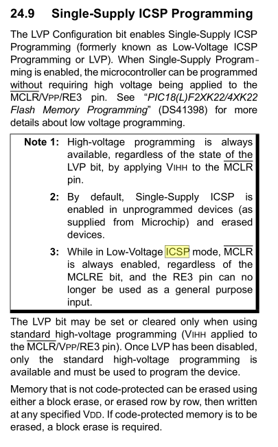

# Programing Setup

## Tools
[Microchip MPLAB](https://www.microchip.com/en-us/development-tools-tools-and-software/mplab-x-ide)
- Install 8-bit and 16-bit support.

[Code Configurator](https://www.microchip.com/en-us/development-tools-tools-and-software/embedded-software-center/mplab-code-configurator)

[XC Compilers](https://www.microchip.com/en-us/development-tools-tools-and-software/mplab-xc-compilers)

### MPLABX Guide / Tips

- `Ctrl-Click` on a symbol to go to definition.
- PICKit4 programmer has internal pull-downs of 4.7k on CLK, PDA lines.

To configure register access `Window -> Target Memory Views -> Configuration Bits`. This will allow to generate new configuration *pragmas*.

```
FEXTOSC - LP        : Use LP 32.768KHz low power mode.
RSTOSC  - LFINTOSC  : Use LP on reset.
MCLRE   -           : EXTMLCR
DEBUG   - ON        : Enable debugging.
WDTE    - Off       : Disable Watch Dog Timer for dev.
LVP     - OFF       : Must Use MCLR for programing in HV programing.
```

> The configuration is set for the target board to supply its own power but no voltage has been detected on VDD. Please ensure you have your target powered up and try again.
> Connection Failed.

`File > Project Properties` then in new window `Conf > PICkit 4`. Select `Option Categories: Power`. Here we can toggle external or internal. **Only 50mA of current provided at 5v.**

> Target Device ID (0x0) is an Invalid Device ID. Please check your connections to the Target Device.

You are probably not in debug mode.


> Warning: The hex file has the debug bit set.  The debug bit has been cleared during load to memory.  The original hex file has not been modified.

You are probably not in debug mode.

## Revisions

- v0.1
	- Basic Blink functionality
	- Prototype of AC controller on Arduino

## Device

[PIC18F26K22](../Datasheets/datasheet%20PIC18F26K22%20(microcontroller).pdf)
```
                                 ┌────┐__┌────┐
           PROG_EN  MCLR/VPP/RE3 ├  1      28 ┤ RB7/ICSP_DAT PGD
           ~SEG_A            RA0 ├  2      27 ┤ RB6/ICSP_CLK PGC
           ~SEG_B            RA1 ├  3      26 ┤ RB5                 *Speaker
           ~SEG_C            RA2 ├  4      25 ┤ RB4                ~BUZZER_EN
           ~SEG_D            RA3 ├  5      24 ┤ RB3                 TEST_LED
           ~SEG_E            RA4 ├  6      23 ┤ RB2      INT2 SDA2  *Extra Int
           ~SEG_F            RA5 ├  7      22 ┤ RB1      INT1 SCL2  GESTURE_INT
                             VSS ├  8      21 ┤ RB0      INT0       AC_ZEROX_INT
           ~SEG_G            RA7 ├  9      20 ┤ VDD
           ~SEG_DP           RA6 ├ 10      19 ┤ VSS
           DIGIT_A           RC0 ├ 11      18 ┤ RC7                 *Unused
           DIGIT_B           RC1 ├ 12      17 ┤ RC6      CTS1       TB2
           ~ALARM_EN         RC2 ├ 13      16 ┤ RC5      RX1        TB1
                  SCK1 SCL1  RC3 ├ 14      15 ┤ RC4      SDA1 SDI1
                                 ╘════════════╛
                                  PIC18F26K42
Stats:
64K Bytes Flash
32768 Single Word Instructions
3896 Bytes SRAM
1024 Bytes EEPROM
25   I/O
19   10-bit A/D Channels
2    SPI
2    I2C
3    8-bit timers
4    16-bit timers


19 Free Pins. 167seg. 1 buzzer. 1 ac control. 1 sound.

with SPI 17 free pins. 
```


## Reset
Reset is done via the MCLR pin. Active low for reset. Can be toggled by MCLRE pin.

## In-Circuit Programing ICPS
Mode is PGC and PGD.
LVP bit must be enabled.

24.9 Single-Supply ICSP Programming.


See "Flash Memory Programming".

> The LVP bit may be set or cleared only when using standard high-voltage
> programming (VIHH applied to the MCLR/VPP/RE3 pin). Once LVP has been
> disabled, only the standard high-voltage programming is available and must
> be used to program the device.


## Compare Modules
Ref 14.2 Compare Mode in datasheet.
Compare mode lets us trigger and external event a set-time after 


